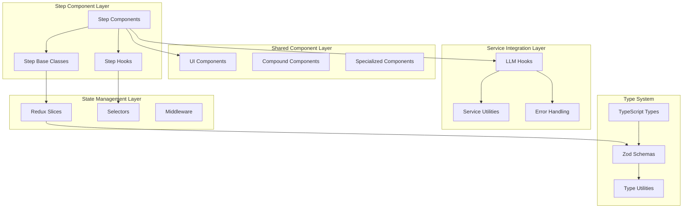
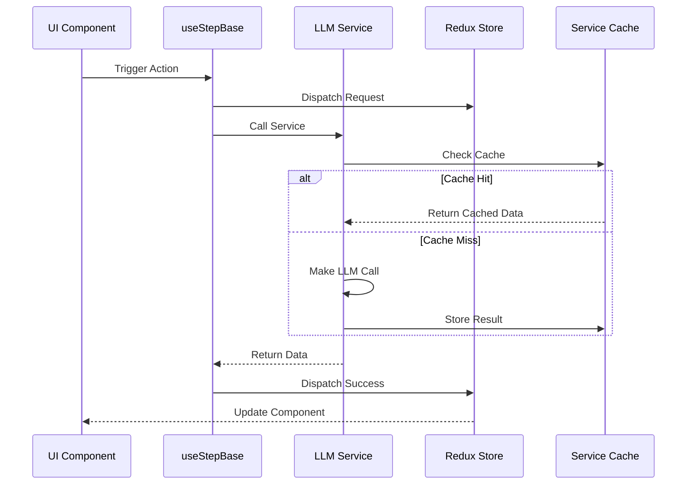

# Design Document: Flow Steps Optimization

## Overview

This design document outlines the comprehensive optimization and simplification of the `/flow/steps/` components and Redux state management in the resume-oracle-ui project. The optimization focuses on reducing code complexity, eliminating duplication, and accelerating feature development through standardized patterns and architectural improvements.

### Design Goals

1. **Standardize Step Component Architecture** - Create unified patterns for step component creation and management
2. **Eliminate Code Duplication** - Extract common UI patterns, utilities, and service integration logic
3. **Optimize Redux State Management** - Consolidate related state and standardize patterns
4. **Unify TypeScript Type System** - Standardize between Zod schemas and TypeScript interfaces
5. **Improve Development Experience** - Create templates, patterns, and tools for faster development

## Architecture

### Current Architecture Analysis

**Strengths:**
- Well-established multi-step flow with `createStep` HOC
- Consistent `useLlmService` hook for service integration
- Clear separation between UI components and business logic
- Modular component structure with compound components

**Issues Identified:**
- Inconsistent state management patterns across slices
- Duplicated UI patterns (modals, action bars, cards)
- Mixed type definitions (Zod schemas vs TypeScript interfaces)
- Complex component hierarchies with excessive prop drilling
- Scattered error handling and loading state management

### Proposed Architecture



## Components and Interfaces

### 1. Step Component Architecture

#### Base Step Component System

```typescript
// Enhanced Step Definition
interface StepDefinition<TProps = any> {
  id: string;
  label: string;
  description?: string;
  isOptional?: boolean;
  component: React.ComponentType<TProps>;
  validation?: StepValidationSchema;
  dependencies?: string[];
}

// Step Base Hook
interface UseStepBaseReturn<TState = any> {
  stepState: TState;
  isLoading: boolean;
  error: string | null;
  setStepState: (state: Partial<TState>) => void;
  validateStep: () => boolean;
  resetStep: () => void;
}

// Step Context Provider
interface StepContextValue {
  stepId: string;
  isActive: boolean;
  isCompleted: boolean;
  canProceed: boolean;
  markComplete: () => void;
  showError: (message: string) => void;
  showSuccess: (message: string) => void;
}
```

#### Standardized Step Components

```typescript
// Base Step Component Template
interface BaseStepProps {
  className?: string;
  onComplete?: () => void;
  onError?: (error: string) => void;
}

// Step Wrapper Component
const StepWrapper: React.FC<{
  stepId: string;
  children: React.ReactNode;
  validation?: () => boolean;
}> = ({ stepId, children, validation }) => {
  // Provides consistent layout, error handling, loading states
  // Integrates with step navigation system
};

// Enhanced createStep Factory
function createStep<TProps = {}>(config: StepConfig) {
  return (component: React.ComponentType<TProps & BaseStepProps>) => {
    const WrappedComponent = (props: TProps) => (
      <StepWrapper stepId={config.id} validation={config.validation}>
        <component {...props} />
      </StepWrapper>
    );
    
    return {
      ...config,
      component: WrappedComponent
    } as StepDefinition<TProps>;
  };
}
```

### 2. Shared UI Component System

#### Common Component Patterns

```typescript
// Standardized Modal System
interface BaseModalProps {
  open: boolean;
  onClose: () => void;
  title: string;
  description?: string;
  size?: 'sm' | 'md' | 'lg' | 'xl';
  className?: string;
}

interface ActionModalProps extends BaseModalProps {
  primaryAction: {
    label: string;
    onClick: () => void;
    loading?: boolean;
    disabled?: boolean;
  };
  secondaryAction?: {
    label: string;
    onClick: () => void;
  };
}

// Standardized Action Bar
interface ActionBarProps {
  actions: ActionBarAction[];
  variant?: 'primary' | 'secondary';
  alignment?: 'left' | 'center' | 'right' | 'between';
  className?: string;
}

interface ActionBarAction {
  id: string;
  label: string;
  icon?: React.ComponentType;
  onClick: () => void;
  variant?: 'primary' | 'secondary' | 'ghost' | 'destructive';
  disabled?: boolean;
  loading?: boolean;
}

// Standardized Data Card
interface DataCardProps {
  title: string;
  subtitle?: string;
  content: React.ReactNode;
  actions?: CardAction[];
  isCollapsible?: boolean;
  defaultCollapsed?: boolean;
  isLoading?: boolean;
  error?: string;
  className?: string;
}
```

#### Compound Component Patterns

```typescript
// Modal Compound Component
interface ModalCompound {
  Root: React.FC<BaseModalProps>;
  Header: React.FC<{ children: React.ReactNode }>;
  Content: React.FC<{ children: React.ReactNode }>;
  Footer: React.FC<{ children: React.ReactNode }>;
  Actions: React.FC<{ actions: ModalAction[] }>;
}

// Form Compound Component
interface FormCompound {
  Root: React.FC<FormProps>;
  Section: React.FC<FormSectionProps>;
  Field: React.FC<FormFieldProps>;
  Actions: React.FC<FormActionsProps>;
}
```

### 3. Service Integration Architecture

#### Enhanced LLM Service Hook

```typescript
// Enhanced useLlmService with better error handling and caching
interface UseLlmServiceConfig {
  enableCache?: boolean;
  cacheKey?: string;
  retryCount?: number;
  onSuccess?: (data: any) => void;
  onError?: (error: any) => void;
}

interface UseLlmServiceReturn<T> {
  trigger: (...params: any[]) => Promise<T>;
  isLoading: boolean;
  error: ServiceError | null;
  data: T | null;
  retry: () => void;
  reset: () => void;
  clearCache: () => void;
}

// Service Error Types
interface ServiceError {
  code: string;
  message: string;
  details?: any;
  retry?: boolean;
}

// Service Integration Hook
function useServiceIntegration<TInput, TOutput>(
  service: ServiceFunction<TInput, TOutput>,
  config?: UseLlmServiceConfig
): UseLlmServiceReturn<TOutput>
```

#### Standardized Service Patterns

```typescript
// Service State Management
interface ServiceState<T> {
  data: T | null;
  isLoading: boolean;
  error: ServiceError | null;
  lastUpdated: number | null;
  cache: Map<string, CacheEntry<T>>;
}

// Service Action Creators
interface ServiceActions<T> {
  request: () => Action;
  success: (data: T) => Action;
  failure: (error: ServiceError) => Action;
  reset: () => Action;
  clearCache: () => Action;
}
```

### 4. State Management Optimization

#### Consolidated State Structure

```typescript
// Unified Application State
interface AppState {
  // Navigation State
  navigation: {
    currentStep: number;
    stepHistory: number[];
    canProceed: boolean;
    isCompleted: boolean;
  };
  
  // Core Data State
  core: {
    profileSections: ProfileSection[];
    jobDescription: string;
    requirements: RequirementCluster[];
    matches: MatchingResult;
  };
  
  // Generated Content State
  generated: {
    resumeSections: ResumeSection[];
    resume: Resume;
    coverLetter: CoverLetter;
  };
  
  // UI State
  ui: {
    activeModals: string[];
    notifications: Notification[];
    loading: LoadingState;
    errors: ErrorState;
  };
  
  // Configuration State
  config: {
    llm: LlmConfig;
    preferences: UserPreferences;
  };
}
```

#### Standardized Slice Patterns

```typescript
// Base Slice Configuration
interface BaseSliceConfig<T> {
  name: string;
  initialState: T;
  reducers: Record<string, SliceReducer<T>>;
  extraReducers?: (builder: ActionReducerMapBuilder<T>) => void;
}

// Async Slice Pattern
interface AsyncSliceState<T> {
  data: T | null;
  isLoading: boolean;
  error: string | null;
  lastUpdated: number | null;
}

// Create standardized async slice factory
function createAsyncSlice<T>(config: AsyncSliceConfig<T>) {
  return createSlice({
    name: config.name,
    initialState: {
      data: null,
      isLoading: false,
      error: null,
      lastUpdated: null,
      ...config.initialState
    } as AsyncSliceState<T>,
    reducers: {
      request: (state) => {
        state.isLoading = true;
        state.error = null;
      },
      success: (state, action: PayloadAction<T>) => {
        state.data = action.payload;
        state.isLoading = false;
        state.error = null;
        state.lastUpdated = Date.now();
      },
      failure: (state, action: PayloadAction<string>) => {
        state.isLoading = false;
        state.error = action.payload;
      },
      reset: (state) => {
        state.data = null;
        state.isLoading = false;
        state.error = null;
        state.lastUpdated = null;
      },
      ...config.reducers
    }
  });
}
```

#### Selector Patterns

```typescript
// Standardized Selector Patterns
interface SelectorFactory<T> {
  selectAll: (state: RootState) => T[];
  selectById: (id: string) => (state: RootState) => T | undefined;
  selectIsLoading: (state: RootState) => boolean;
  selectError: (state: RootState) => string | null;
  selectLastUpdated: (state: RootState) => number | null;
}


```

## Data Models

### Type System Standardization

#### Zod Schema to TypeScript Type Pipeline

```typescript
// Core Data Models (Zod Schemas - LLM Service Contracts)
// These schemas MUST remain unchanged as they're part of LLM prompt outputs
import {
  ProfileSectionSchema,
  JobRequirementSchema,
  MatchedProfileSectionSchema,
  // ... all existing Zod schemas from zodModels.ts
} from '@/services/zodModels';

// Derived TypeScript Types
export type ProfileSection = z.infer<typeof ProfileSectionSchema>;
export type JobRequirement = z.infer<typeof JobRequirementSchema>;
export type MatchedProfileSection = z.infer<typeof MatchedProfileSectionSchema>;

// Application-Specific Types (Pure TypeScript)
interface ProfileSectionWithMeta extends ProfileSection {
  createdAt: Date;
  updatedAt: Date;
  isOptimized: boolean;
  optimizationScore?: number;
}

interface UIProfileSection extends ProfileSectionWithMeta {
  isCollapsed: boolean;
  isEditing: boolean;
  isDirty: boolean;
}
```

#### Component Props Type Standards

```typescript
// Standardized Props Naming Convention
interface ComponentNameProps {
  // Required props first
  id: string;
  data: ComponentData;
  
  // Optional props with defaults
  variant?: 'primary' | 'secondary';
  size?: 'sm' | 'md' | 'lg';
  disabled?: boolean;
  loading?: boolean;
  
  // Event handlers
  onClick?: (id: string) => void;
  onChange?: (data: ComponentData) => void;
  onError?: (error: Error) => void;
  
  // Style props
  className?: string;
  style?: React.CSSProperties;
  
  // Children/composition
  children?: React.ReactNode;
}

// Generic Component Props
interface BaseComponentProps {
  className?: string;
  'data-testid'?: string;
}

// Modal Props Pattern
interface ModalProps extends BaseComponentProps {
  open: boolean;
  onClose: () => void;
  title: string;
  description?: string;
}

// Form Props Pattern
interface FormProps<T> extends BaseComponentProps {
  initialValues: T;
  onSubmit: (values: T) => void | Promise<void>;
  validate?: (values: T) => Record<string, string>;
  disabled?: boolean;
}
```

### Data Flow Architecture



## Error Handling

### Standardized Error Management

```typescript
// Error Classification System
enum ErrorType {
  VALIDATION = 'validation',
  SERVICE = 'service',
  NETWORK = 'network',
  PERMISSION = 'permission',
  UNKNOWN = 'unknown'
}

interface AppError {
  type: ErrorType;
  code: string;
  message: string;
  details?: any;
  timestamp: Date;
  context?: Record<string, any>;
}

// Error Boundary Component
interface ErrorBoundaryProps {
  fallback?: React.ComponentType<{ error: Error; retry: () => void }>;
  onError?: (error: Error, errorInfo: React.ErrorInfo) => void;
  isolate?: boolean; // Whether to isolate errors to this boundary
}

// Error Handler Hook
interface UseErrorHandlerReturn {
  showError: (error: AppError | string) => void;
  clearError: () => void;
  retryLastAction: () => void;
  errors: AppError[];
}

// Service Error Handling
interface ServiceErrorHandler {
  handleError: (error: any) => AppError;
  shouldRetry: (error: AppError) => boolean;
  getRetryDelay: (attempt: number) => number;
}
```

### Error Recovery Patterns

```typescript
// Retry Logic for Services
interface RetryConfig {
  maxAttempts: number;
  backoffMultiplier: number;
  baseDelay: number;
  maxDelay: number;
}

// Error Toast System
interface ErrorToastConfig {
  duration: number;
  showRetry: boolean;
  actionLabel?: string;
  onAction?: () => void;
}

// Global Error Handler
interface GlobalErrorHandler {
  captureError: (error: AppError) => void;
  reportError: (error: AppError) => Promise<void>;
  showUserError: (error: AppError) => void;
}
```

### Component Testing Standards

```typescript
// Test Utilities
interface ComponentTestUtils<T> {
  renderWithProviders: (props: T) => RenderResult;
  mockStore: MockStore;
  mockServices: MockServiceProvider;
  waitForAsyncUpdates: () => Promise<void>;
}

// Step Component Test Template
interface StepTestSuite {
  'should render with initial state': () => void;
  'should handle service calls correctly': () => void;
  'should update state on user interactions': () => void;
  'should handle errors gracefully': () => void;
  'should validate before proceeding': () => void;
}

// Service Integration Tests
interface ServiceTestSuite<T> {
  'should call service with correct parameters': () => void;
  'should handle successful responses': () => void;
  'should handle service errors': () => void;
  'should use cache when appropriate': () => void;
  'should retry failed requests': () => void;
}
```

### Redux Testing Patterns

```typescript
// Slice Test Utilities
interface SliceTestUtils<T> {
  getInitialState: () => T;
  dispatchAction: (action: any) => T;
  expectStateChange: (before: T, after: T, matcher: (state: T) => boolean) => void;
}

// Async Action Testing
interface AsyncActionTestSuite {
  'should dispatch request action': () => void;
  'should dispatch success on successful service call': () => void;
  'should dispatch failure on service error': () => void;
  'should update loading state correctly': () => void;
}
```


## Migration Strategy

### Phase 1: Foundation (Week 1-2)
1. Create base component system and step wrapper
2. Implement standardized modal and action bar components
3. Set up enhanced error handling system
4. Create type standardization utilities

### Phase 2: Step Components (Week 3-4)
1. Refactor `GetStartedStep` using new patterns
2. Optimize `ProfileSectionsStep` with shared components
3. Simplify `JobRequirementsMatchingStep` component hierarchy
4. Update remaining step components

### Phase 3: State Management (Week 5-6)
1. Consolidate related slices using new patterns
2. Implement standardized selector patterns
3. Optimize async state management
4. Add basic error handling to store

### Phase 4: Service Integration (Week 7)
1. Enhance `useLlmService` hook with new features
2. Standardize service error handling
3. Implement basic caching strategies

### Phase 5: Documentation & Testing (Week 8)
1. Create component templates and examples
2. Write essential documentation only


## Design Decisions and Rationales

### 1. Component Architecture
**Decision**: Use compound components for complex features
**Rationale**: Provides better composition, reusability, and testing capabilities

### 2. State Management
**Decision**: Consolidate related state into fewer, more focused slices
**Rationale**: Reduces complexity, improves performance, and simplifies selectors

### 3. Type System
**Decision**: Keep Zod schemas for LLM contracts, use derived TypeScript types
**Rationale**: Maintains LLM service compatibility while improving development experience

### 4. Error Handling
**Decision**: Centralized error management with typed error objects
**Rationale**: Provides consistent error experience and easier debugging

### 5. Service Integration
**Decision**: Enhanced `useLlmService` with advanced caching and retry logic
**Rationale**: Improves reliability, performance, and user experience

## Success Metrics

### Development Experience
- **Reduced component creation time**: 50% faster new step development
- **Lower bug count**: 40% reduction in component-related bugs
- **Improved code review speed**: 30% faster review process

### Code Quality
- **Reduced code duplication**: 60% reduction in duplicate patterns
- **Improved test coverage**: 90%+ coverage for step components
- **Enhanced type safety**: 100% TypeScript strict mode compliance

### Performance
- **Faster rendering**: 20% improvement in component render times
- **Better cache hit rates**: 80%+ cache utilization for service calls
- **Reduced bundle size**: 15% reduction through better tree shaking

This design provides a comprehensive foundation for optimizing the flow steps while maintaining stability and improving developer experience. The modular approach allows for incremental implementation without breaking existing functionality.
