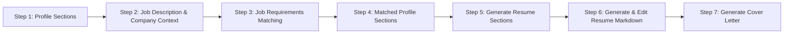

## Multi-Step Flow: Smart Profile & Job Matching & Resume Generation



This document outlines the user journey, UI layouts, labels, and behaviors for a seven-step flow, with all data persisted in the client using Redux Toolkit + redux-persist (UI‑First Persistence).

---

### 🔹 Step 1: Profile Sections

**Purpose:** Allow users to add free-form profile content (experience, education, projects, etc.)

**Header & Navigation**

```
Step 1 of 7: Profile Sections
[ ← (disabled) ]    [ Continue to Job Description → ]
```

**Add Section Control**

```
+ Add Profile Section ▼
(Options: Experience, Education, Project, Certification, Volunteering, Award, Course, Custom Section)
```

**Section Cards**

```
┌────────────────────────────────────────────┐
│ Section: Experience                       │
├────────────────────────────────────────────┤
│ [Rich Text Editor / Textarea]             │
│ "Worked as a frontend engineer ..."      │
├────────────────────────────────────────────┤
│ ✏️ Edit     🗑 Delete                      │
└────────────────────────────────────────────┘
```

**Import/Export Controls**

```
[⬆️ Export Profile Sections (JSON)]  [⬇️ Import Profile Sections (JSON)]
```

**UX Behavior:**

- Users can reorder cards via drag-and-drop
- Edit opens inline form
- Delete prompts confirmation
- Sections are collapsible by default (type + preview shown)
- Continue only enabled when ≥1 section exists
- Import/Export uses JSON, robust error handling

---

### 🔹 Step 2: Job Description & Company Context

**Purpose:** Collect the job description and optional company details for matching

**Header & Navigation**

```
Step 2 of 6: Job Description & Company Details
[ ← Back to Profile Sections ]    [ Continue to Matching → ]
```

**Inputs Layout**

```
🔹 Job Description (required)
[Multiline Textarea]
Placeholder: "We’re looking for a Senior Backend Engineer..."

🔹 Company Culture / Values (optional)
[Multiline Textarea]
Placeholder: "We value transparency, customer obsession..."
```

**UX Behavior:**

- Show character count / word count
- Validate non-empty for job description
- Company context is optional and can be collapsed/expanded

---

### 🔹 Step 3: Job Requirements Matching

**Purpose:** Display one-to-one matches between extracted job requirements and user profile sections

**Header & Navigation**

```
Step 3 of 6: Job Requirements Matching
[ ← Back to Job Description ]    [ Continue to Matched Profile Sections → ]
```

**Core List View**

```
──────────────────────────────────────────
📋 Job Requirement:
"Experience with CI/CD and deployment automation"

❌ No matching profile section found
Gap: No profile section covers this requirement.

[🔍 See Suggested Section Based on This Requirement]  [⏭ Skip]
──────────────────────────────────────────
📋 Job Requirement:
"3+ years of experience building accessible web applications"

Matched Profile Section: Experience – React Engineer @ Leniolabs
Confidence: High  [✓ No action needed]
──────────────────────────────────────────
```

**Suggested Section Modal**

```
────────────────────────────────────────────
📄 Suggested Profile Section
────────────────────────────────────────────
Requirement: "Experience with CI/CD and deployment automation"

Type: [Experience ▼]
Content:
[Multiline Textarea]
"Led CI/CD pipeline integration using GitHub Actions ..."
────────────────────────────────────────────
[✅ Save & Match]  [📝 Save Only]  [⏭ Skip]
────────────────────────────────────────────
```

**UX Behavior:**

- `See Suggested Section` generates an editable draft
- `Save & Match` adds the section and links it to the requirement
- `Save Only` adds to profile without matching
- `Skip` leaves requirement unmatched
- All matching/enhancement uses real API calls

---

### 🔹 Step 4: Matched Profile Sections

**Purpose:** Review and enhance profile sections grouped by matched requirements

**Header & Navigation**

```
Step 4 of 6: Matched Profile Sections
[ ← Back to Matching ]    [ Continue to Generate Resume Sections → ]
```

**Grouped View**

```
────────────────────────────────────────────
Profile Section: Experience – React Engineer @ Leniolabs
Matched Requirements:
- "3+ years of experience building accessible web applications"
- ...

[🪄 Enhance Section]
────────────────────────────────────────────
```

**Enhance Modal**

```
────────────────────────────────────────────
🪄 Enhance Profile Section
────────────────────────────────────────────
Section: Experience – React Engineer @ Company

[Multiline Textarea with AI suggestions]
────────────────────────────────────────────
[✅ Save Enhancement]  [⏭ Skip]
────────────────────────────────────────────
```

**UX Behavior:**

- Sections are grouped and collapsible
- Enhanced sections are marked; recommendations/gaps cleared in Redux
- Enhancement uses modal with AI suggestions

---

### 🔹 Step 5: Generate Resume Sections

**Purpose:** Generate tailored resume sections via API and allow editing

**Header & Navigation**

```
Step 5 of 6: Generate Resume Sections
[ ← Back to Matched Profile Sections ]    [ Continue to Resume Markdown → ]
```

**Generated Sections View**

```
────────────────────────────────────────────
Section: Experience
[Editable Textarea]
────────────────────────────────────────────
Section: Education
[Editable Textarea]
────────────────────────────────────────────
...
[💾 Save Changes]  [🔄 Regenerate]
────────────────────────────────────────────
```

**UX Behavior:**

- Sections are generated via API
- All sections are editable inline
- Save updates Redux state
- Regenerate calls API again

---

### 🔹 Step 6: Generate & Edit Resume Markdown

**Purpose:** Generate, edit, and export the full resume in markdown and PDF

**Header & Navigation**

```
Step 6 of 6: Generate & Edit Resume Markdown
[ ← Back to Resume Sections ]    [ Finish & Export → ]
```

**Markdown Editor & Preview**

```
────────────────────────────────────────────
[Markdown Editor | Live Preview]
────────────────────────────────────────────
Optimization Summary:
"Your resume is highly tailored for the job description."
────────────────────────────────────────────
[💾 Save Draft]  [⬇️ Export Markdown]  [⬇️ Export as PDF]
────────────────────────────────────────────
```

**UX Behavior:**

- Markdown is generated via API, editable in a live editor
- Preview updates in real time
- Optimization summary from API is shown
- Save draft persists to Redux/UI
- Export Markdown downloads .md file
- Export as PDF uses styled, selectable text (not image)
- PDF export matches on-screen preview, uses dedicated CSS module

---

### 🔹 Step 7: Generate Cover Letter

**Purpose:** Automatically create a tailored cover letter using the user's mayched profile section, job requirements, and company context. Users can then review, edit, and export the final letter.

**Header & Navigation**

```
Step 7 of 7: Cover Letter
[ ← Back to Resume Editor ]    [ Finish → ]
```

**UI Layout**

A **full-width Markdown editor** with two sections:

1. **Optimization Summary** (collapsible)

```
🔍 Optimization Summary:
  • Top Strengths to Highlight: Accessibility leadership; CI/CD automation expertise
  • Core Values Match: Transparency; rapid iteration; customer-centric
  • Tone Tips: Concise, confident, warm
```

2. **Cover Letter Editor**

```
┌──────────────────────────────────────────────────────┐
│ # [Your Name]                                      │
│ *[Your Role]*                                      │
│ [Email] • [Phone] • [LinkedIn]                      │
│                                                     │
│ Dear [Hiring Manager],                             │
│                                                     │
│ I’m excited to apply for the [Job Title] role at    │
│ [Company Name]. With my experience in ...           │
│                                                     │
│ Best regards,                                       │
│ [Your Name]                                        │
└──────────────────────────────────────────────────────┘

[📋 Copy to Clipboard]  [📥 Download Markdown]
```

**UX Behavior:**

- **Contextual Input:** The LLM receives:
  - `matched_profile_sections`: array of sections with their content and matched requirements
  - `company_context` (optional): brief description of values and culture
  - `tone_guidance`: a snippet of the job description (e.g., the first 2–3 sentences or key bullet points) to set the right tone and wording
- **Optimization Summary:** Auto-generated section highlighting strengths, value fits, and tone suggestions.
- **Editable Editor:** Users can toggle the summary visibility and edit the cover letter directly in Markdown.
- **Export Controls:** Copy to clipboard or download the Markdown file upon completion.
- **Auto-Generate:** On entering Step 7, app calls LLM endpoint
- **Editable:** User can fine-tune content directly.
- **Export:** Allows download as `.md`, or copy to clipboard.

**LLM Integration**

- **Endpoint:** `/api/generate_cover_letter`
- **Method:** POST
- **Request Body (TypeScript types):**

```json
{
  "matched_profile_sections": [
    {
      "profileSection": {
        "id": "string",
        "type": "string",
        "content": "string"
      },
      "baseJobRequirementMatches": [
        {
          "requirement": "string"
        }
      ]
    }
  ],
  "company_context": "string?",
  "tone_guidance": "string"
}
```

- **Response:**

```json
{
  "optimization_summary": "string",
  "cover_letter_markdown": "string"
}
```

---

**Data Structures**

1. **Profile Sections**

```json
{ id: string, type: string, content: string }
```

2. **Job & Company Input**

```json
{ job_description: string, company_context: string|null }
```

3. **Matches**

```json
{
  matches: [
    {
      id: string,
      requirement_id: string,
      requirement: string,
      profile_section_id: string|null,
      confidence: string|null,
      gap_description: string|null,
      recommendation?: string|null
    }
  ]
}
```

4. **Generated Resume Sections**

```json
[
  { id: string, type: string, content: string }
]
```

5. **Resume Markdown**

```json
{
  markdown: string,
  optimization_summary: string
}
```

6. **Cover Letter Generation**

```json
{
  optimization_summary: string,
  cover_letter_markdown: string
}
```

---

This multi-step flow ensures a guided, interactive experience for users to build, match, enhance, and generate their resume and cover letter content, with robust import/export and editing features throughout.

---

